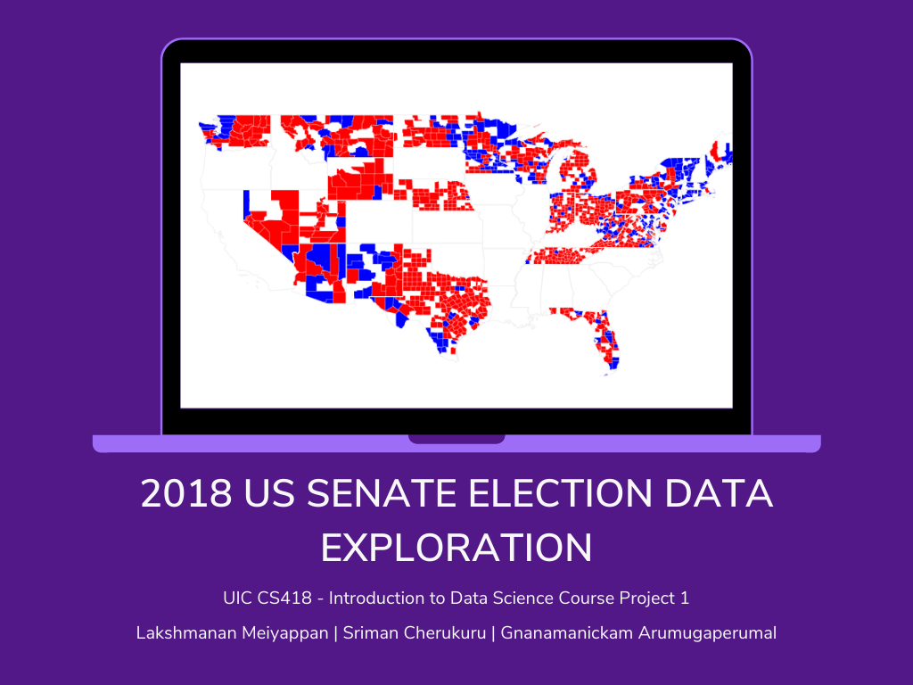
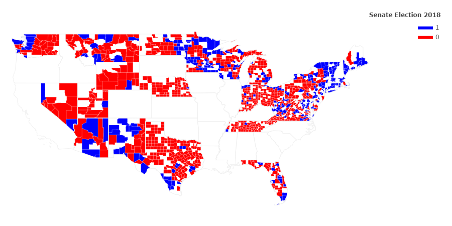
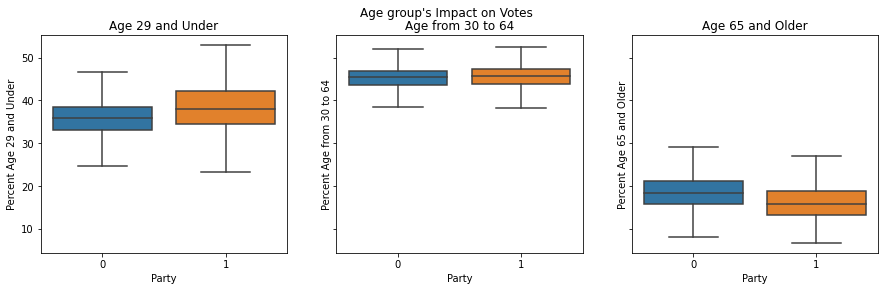
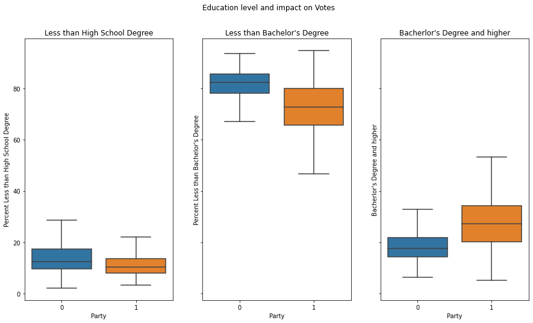
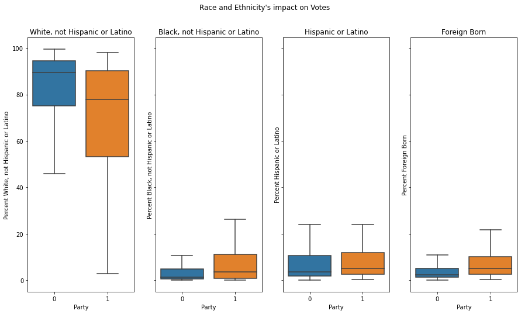
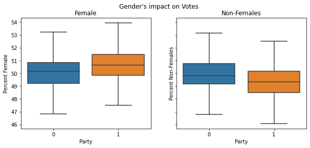

# 2018 US Senate Election Data-Exploration



## About

2018 US Senate Election Data-Exploration is a project done as part of the UIC's CS418 Coursework under Professor Dr. Gonzalo Bello. 

_'election_train.csv'_ and _'demographics_train.csv'_ are the datasets based on which this project has been built. These csv files can be found in the 'data' directory of this repository.

## Report
Report and PDF file of the IPython notebook are available in the **'report'** directory.
## Team
<table>
    <tr>
        <th>Name</th>
        <th>UIN</th>
        <th>NetID</th>
        <th>Role</th>
    </tr>
    <tr>
        <td><a href="https://github.com/Gnanamanickam">Gnanamanickam Arumugaperumal</a></td>
        <td>670991279</td>
        <td>garumu3</td>
        <td>Project Manager</td>
    </tr>
    <tr>
        <td><a href="https://github.com/sriman98">Sriman Cherukuru</a></td>
        <td>659640984</td>
        <td>scheru4</td>
        <td>Time keeper</td>
    </tr>
    <tr>
        <td><a href="https://github.com/laxmena">Lakshmanan Meiyappan</a></td>
        <td>671997054</td>
        <td>lmeiya2</td>
        <td>Scribe</td>
    </tr>
</table>

## How to run this project?
_Note: Setting up Anaconda distribution is highly recommended to run this project._
1. Download or clone this repository into your workspace.
2. Naviagte to the Downloaded\Cloned directory: **2018Election-Data-Visualization/**.
2. Install the required libraries using the command 
    ```pip install requirements.txt```
3. Open IPython Notebook: **EDA-2018SenateElections.ipynb** with Jupyter Notebook.
4. Run the cells sequentially to see the execution results.

## Data Visualizations

**Legend:** 
- **0** represents **Republican party** & 
- **1** represents **Democrat party**.

1. **Counties and Winners Visualization:**
    

2. **Age groups and their voting patterns**
    

3. **Education Level and its impact on voting patterns**
    

4. **Ethnicity and its impact on voting patterns**
 

5. **Gender and its impact on voting patterns**
    

